<section id="abstract">

 This document describes the morphology module of the Lexicon Model for Ontologies as a result of the work of the Ontology Lexicon community group (OntoLex-Morph). The module is targeted at the representation of linguistic morphology in dictionaries and other linguistic resources, as well as the formalization of rules for word formation and inflection as employed in computational morphology and grammatical appendices as frequently provided as part of bilingual dictionaries.

 This module operates in combination with the lemon core module and extends it with support for two distinct views on linguistic morphology:

(1) OntoLex-Morph enables the enrichment of lexical entries and individual forms with information about the morphological units that they consist of (descriptive morphology). This improves the capability of OntoLex-Lemon to encode, preserve and document the structure of morphologically complex forms or lexical entries. 

(2) OntoLex-Morph allows the formalization of morphological rules that can be used to produce complex lexical entries and inflected forms from their component morphs and their base forms (generative morphology). This extends OntoLex-Lemon resources with a framework that describes how to produce and analyze complex lexical entries or inflected forms.

 OntoLex-Morph has been designed with the premise to make OntoLex-lemon applicable to morphologically rich languages of any type, supporting both fusional and agglutinating morphology, and thereby contributing to a truly multilingual web.

The RDF file with the OntoLex lemon lexicography module can be found at http://www.w3.org/ns/lemon/morph
</section>

<section id="sotd">

This document is an official report of the OntoLex community group. It does not represent the view of single individuals but reflects the consensus and agreement reached as part of the regular group discussions. The report should be regarded as the official specification of lemon.

If you wish to make comments regarding this document, please send them to public-ontolex@w3.org (subscribe, archives).

</section>

<section id="introduction">

## Introduction

Morphology is a vital and, in many languages, very sophisticated part of language, and as such it has been an important part of the work of lexicographers. In the traditional print form, morphological information is provided in brief abbreviated terms that can only be deciphered with significant knowledge of the language, however, digital dictionaries are capable of representing this information in a more structured and machine-readable way. The OntoLex-Morph module is designed to provide a way to represent morphological information in a structured way that is compatible with the OntoLex-Lemon model.

The morphology module aims at fulfilling two modelling purposes:

1. Stating elements that are involved in the decomposition of lexical entries and forms.
  - Morphological decomposition on the lexical entry level.<br/>
    The kind of elements of which a lexical entry can consist should be as non-restrictive as possible. I.e. The decomposition of lexical entries encompasses lexical entries, components, derivational affixes, inflectional affixes, stems, roots and zero morphs. However, a lexical entry can NEVER be composed of a form!

  - Morphological decomposition on the form level.<br/>
    Elements of which a form can consist include roots, stems, inflectional affixes and zero morphs. 

2. Enabling the representation of building patterns that are involved in the formation of lexical entries and forms.
  - Representation of decompositional building patterns for lexical entries.
  - Representation of decompositional building patterns for forms.

While the model is not capable of providing fine-grained descriptions of phonological and morphophonological processes, the module is capable of representing the morphological processes that are involved in the formation of lexical entries and forms. The module covers use cases typically found in the representation of dictionary data, such as the representation of inflectional and derivational paradigms, as well as the representation of morphological rules that are used in computational morphology.
In order to model more complex morphological representations, users can employ the MMoOn Core ontology — [The Multilingual Morpheme Ontology](https://github.com/MMoOn-Project/MMoOn).


The OntoLex-Morph module aims to represent both traditional dictionary content (which contains only abbreviated information about morphological rules and paradigms, often organized in appendices) and structured computational data (morphological dictionaries) as used in language technology, with the goal of making resources from one community more accessible to the other.

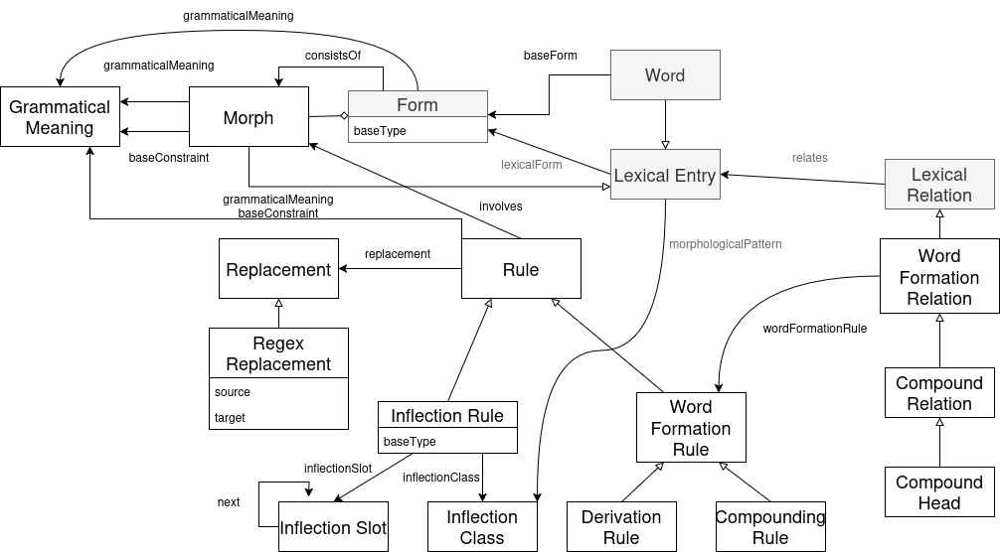

OntoLex-Morph is an extension of the OntoLex model designed to represent morphological processes—such as inflection, derivation, and compounding—across languages, supporting both structural and semantic aspects of morphemes, rules, and grammatical constraints. It enables the formalization of morphological data from various sources, facilitates interoperability between computational morphologies, and supports use cases like generating linguistic labels for ontologies or modelling morphology as a knowledge graph. Central to the model are three classes—morph, rule, and grammatical meaning—which interact to describe how base forms are transformed into surface forms while capturing their morphosyntactic and semantic features.

</section>

<section id="morphological-segments">

## Morphological Segments

_Morphs_ are the basic building blocks within the module that represent a single 
indivisible unit of meaning or grammatical function. They can be roots, stems, affixes, or even zero morphs. 
Morphs represent a single version (allomorph) of a morpheme, which is a more abstract concept. Morphs can be
either bound morphs, which cannot stand alone, or free morphs, which can stand alone as a word. A free morph 
may be a single concept such as "tea" or "pot" in "teapots", while the plural suffix "-s" is a bound morph.

<section id="morphs">

## Morphs

The class **morph:Morph** provides a way to represent sub-word elements and attach grammatical information to them.

<div class="entity">

<class>Morph</class>

**URI:** [http://www.w3.org/ns/lemon/morph#Morph](http://www.w3.org/ns/lemon/morph#Morph)

**morph:Morph** represents any element of morphological analysis below the word level.

<div class="description">
<subclass>ontolex:LexicalEntry</subclass>
</div>

</div>

<!-- <div class="note">
- can carry `lexinfo:termElement` (for what?)
- can consist of other morphs [MP: not in the last version of the diagram; is that intended?] [MI: true, this is no longer the case, but LexicalForms can be, using decomp, so I think we cannot restrict it]
- the model is agnostic as to whether this represents a morpheme or one of its allomorphs, but as a lexical entry
- grammaticalMeaning: glossing information associated with the morph
- baseConstraint: (for affixes) contraints on the elements that this morph can be applied to
- `ontolex:Affix` is defined as a subclass of `morph:Morph`.
- other types of morph (roots, stems, transfix, etc.) are not defined in the module but should be defined in Lexinfo
</div> -->

The property **morph:consistsOf** relates a form with the morphs from which it is constructed.

<div class="entity">

<objectProperty>consistsOf</objectProperty>

**URI:** [http://www.w3.org/ns/lemon/morph#consistsOf](http://www.w3.org/ns/lemon/morph#consistsOf)

Property **morph:consistsOf** states into which Morph resources a Form resource can be segmented.

<div class="description">

<domain>ontolex:Form</domain>

<range>morph:Morph</range>
</div>
</div>

Here is a simple example of a segmentation of the English plural form *cats*:

<aside class="example" title="Example: Segmentation of the English plural form cats">

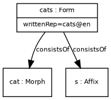

```turtle
:cats a ontolex:Form ;
    ontolex:writtenRep "cats"@en ;
    morph:consistsOf :cat,  :s .

:cat a morph:Morph .

:s a ontolex:Affix .
```
</aside>

This representation does not give the order of the morphs within the word, which 
may be useful for many applications. To give this information, the morphs can
be modelled as an `rdf:Seq` by means of the `rdf:_1`, `rdf:_2`, etc. properties.

<aside class="example" title="Example: Ordered segmentation of the English plural form cats">

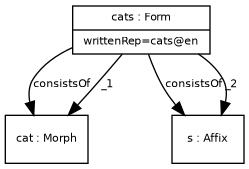

```turtle
:cats a ontolex:Form ;
    ontolex:writtenRep "cats"@en ;
    morph:consistsOf :cat,  :s ;
    rdf:_1 :cat ;
    rdf:_2 :s .

:cat a morph:Morph .

:s a ontolex:Affix .
```
</aside>

</section>

<section id="grammatical-meanings">

## Grammatical Meanings

The class **morph:GrammaticalMeaning** is used to gloss information associated with the morph. This can be either a single element or a node which bundles together several grammatical meanings, e.g. first person and singular. Typically, the bundles will be expressed as blank nodes. The recommended vocabulary to use for the meanings is [LexInfo](https://lexinfo.net/).

<div class="entity">

<class>GrammaticalMeaning</class>

**URI:** [http://www.w3.org/ns/lemon/morph#GrammaticalMeaning](http://www.w3.org/ns/lemon/morph#GrammaticalMeaning)


**morph:GrammaticalMeaning** can be used to represent (bundles of) values of different morpho-syntactic or morpho-semantic features expressed by a form, morph or rule (e.g., value 'nominative' for feature 'case', value 'singular' for feature 'number', etc.; or the feature bundle composed by the latter two values, in a fusional language where they are expressed cumulatively, e.g. Latin)

</div>

<!-- <div class="note">
- should use lexinfo resources or instances with `rdfs:label`
- can represent *either* an individual feature or a feature bundle
</div> -->

The property **morph:grammaticalMeaning** relates an instance of the class `morph:Morph` to an instance of the class `morph:GrammaticalMeaning`. In addition to morphs, the subject of this property can be a `ontolex:Form` as an aggregate of morphs or `morph:Rule` — a rule stating how the form was formed. More details on the rules can be found in the [corresponding section](http://www.w3.org/ns/lemon/morph#Rule).

<div class="entity">

<objectProperty>grammaticalMeaning</objectProperty>

**URI:** [http://www.w3.org/ns/lemon/morph#grammaticalMeaning](http://www.w3.org/ns/lemon/morph#grammaticalMeaning)

property **morph:grammaticalMeaning** assigns a grammatical meaning to a morph, form, or rule

<div class="description">

<domain>ontolex:Form or morph:Morph or morph:Rule</domain>

<range>morph:GrammaticalMeaning</range>
</div>
</div>

For instance, we can update the previous example of the English plural form *cats*, and add the assignment of grammatical meaning to the form and to the corresponding plural morph, which can be expressed in this way.

<aside class="example" title="Example: Segmentation of the English plural form 'cats'">

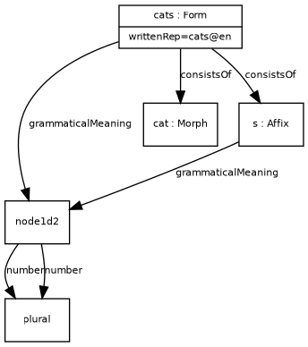

```turtle
:cats a ontolex:Form ;
    ontolex:writtenRep "cats"@en ;
    morph:grammaticalMeaning [ lexinfo:number lexinfo:plural ; ] ;
    morph:consistsOf :cat,  :s .

:cat a morph:Morph .

:s a ontolex:Affix ;
    morph:grammaticalMeaning [ lexinfo:number lexinfo:plural ] .
```
</aside>

In this case, we create a blank node for the grammatical meaning that corresponds to a single feature in Lexinfo. In practice, it might be better to define instances for common morphological meanings and reuse these objects.

For example, in the Latin form *lupus*, nominative case and singular number are expressed cumulatively by the affix *-us*. This is a common combination, therefore, an instance of morph:GrammaticalMeaning is introduced for that feature bundle. This time we use Lexinfo vocabulary alongside with the [Paralex vocabulary](https://www.paralex-standard.org/) — even though Lexinfo is the preferred way to represent grammatical features in OntoLex, there is no restriction on this.

<aside class="example" title="Example: Segmentation of the Latin nominative singular form 'lupus'">

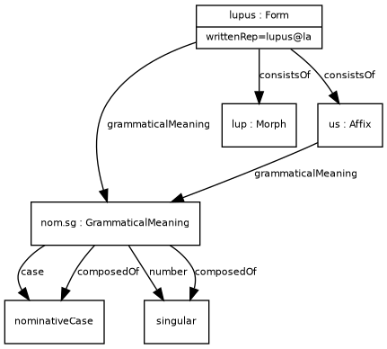

```turtle
:lupus a ontolex:Form ;
    ontolex:writtenRep "lupus"@la ;
    morph:grammaticalMeaning :nom.sg ;
    morph:consistsOf :lup , :us .

:lup a morph:Morph .

:us a ontolex:Affix ;
    morph:grammaticalMeaning :nom.sg .

:nom.sg a morph:GrammaticalMeaning ;
    lexinfo:case lexinfo:nominativeCase ;
    lexinfo:number lexinfo:singular ;
    paralex:composedOf lexinfo:nominativeCase , lexinfo:singular . 
```
</aside>

</section>

<section id="base-forms">

## Constraints and Base Forms

Constraints may be specified on a morph to indicate which grammatical features it can be combined with. This is important for the generation of inflected forms, as it allows us to specify which morphs can be used together in a particular context. For example, in the case of the English plural morpheme '-s', it can only be used with nouns. This information can be encoded using the property `morph:baseConstraint`, which links a morph to its constraints.

The property **morph:baseConstraint** is used to encode information about morphosyntactic constraints for a certain morph, i.e. which grammatical characteristics it requires.

<div class="entity">

<objectProperty>baseConstraint</objectProperty>

**URI:** [http://www.w3.org/ns/lemon/morph#baseConstraint](http://www.w3.org/ns/lemon/morph#baseConstraint)

**morph:baseConstraint** defines the grammatical characteristics of the stem or base that a derivational or inflectional morpheme can be combined with

<div class="description">

<domain>ontolex:Morph or morph:Rule</domain>

<range>morph:GrammaticalMeaning</range>
</div>
</div>

For example, an element for nominal inflection can only be applied to nouns, and derivational affixes can have similar constraints. Note that such information is not applicable to an `ontolex:Form` because this describes only the result of the application of a rule or the addition of a particular form.

As a concrete example, the fact that the English affix -s expresses plural number if attached to nouns, and 3rd person singular agreement if attached to verbs, can be coded as follows using morph:baseConstraint.

<aside class="example" title="Example: Base constraints for the English affix -s">

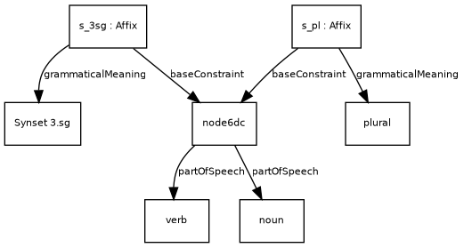

```turtle
:s_pl a ontolex:Affix ;
    morph:grammaticalMeaning lexinfo:plural ;
    morph:baseConstraint [
      lexinfo:partOfSpeech lexinfo:noun  ] .

:s_3sg a ontolex:Affix ;
    morph:grammaticalMeaning :3.sg ;
    morph:baseConstraint [
      lexinfo:partOfSpeech lexinfo:verb ] .
```
</aside>

<!-- Discussion/History:
- CC 2022-10-24: by analogy with morph:grammaticalMeaning, this property should also be applicable to rules to specify necessary preconditions.
 -->

The property **morph:baseForm** is used when some of the derived or inflected forms are formed from a non-canonical form of a lexical entry.
This property is necessary both to represent this information for manual consumption and to be used together with generation rules to provide input data for generating inflected or derived forms.

<div class="entity">

<objectProperty>baseForm</objectProperty>

**URI:** [http://www.w3.org/ns/lemon/morph#baseForm](http://www.w3.org/ns/lemon/morph#baseForm)

**baseForm** is a subproperty of `ontolex:lexicalForm` that indicates the form that is taken as base for the application of inflection or derivation rules to generate other forms.

<div class="description">

<domain>ontolex:Word</domain>

<range>ontolex:Form</range>

<subproperty>ontolex:lexicalForm</subproperty>
</div>
</div>

One example is German verbal inflection (e.g., for `gehen` "to go"), where the canonical form (`gehen`, infinitive) is derived from the base form (`geh-`, stem) by means of a suffix (`-en`, infinitive marker), like other inflected forms (`geh`, `gehst`, `geht` "I/you go; he/she/it goes").

</section>
</section>

<aside class="example" title="Example: Base form for the German verb 'gehen'">

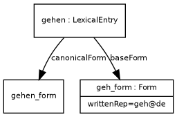

```turtle
:gehen a ontolex:LexicalEntry ;
    ontolex:canonicalForm :gehen_form ;
    morph:baseForm :geh_form .

:geh_form a ontolex:Form ;
    ontolex:writtenRep "geh"@de .
```
</aside>

<section id="morphological-rules">


## Morphological Rules

Morphology in a dictionary is often given in short forms, which the reader must 
interpret to generate the full forms. In the context of a digital resource, this
process can be automated. The OntoLex-Morph module provides classes and properties that allows the specification of _rules_ that can be used to generate derived lexical entries or inflected forms based on existing lexical entries. The application
of these rules is intended to be equivalent across different implementations of the 
model.

Here are the 4 most common situations regarding when and how the generation happens:

1. The lexicon is completely static, no rules are provided: no generation is necessary.
2. The lexicon has canonical forms and a set of rules that specify how to generate the rest of the forms: the generation can be started offline, adding the generated forms to the graph database.
3. Like in the previous case the lexicon has canonical forms and a set of rules but the user does not want to pre-generate the forms: the forms are generated on the fly, during or immediately after the querying step.
4. This can also be a mixture of the two approaches: for most of the entries there are rules and no pre-generated forms, but for highly irregular forms, ones which require complex morphophonological transformations — the forms are pre-generated: the generation can be started offline or on-the-fly for the entries which have rules.

In order to keep the model from becoming too complex, **one rule** is associated with exactly **one morph** and is used to describe the production of exactly **one form** (in case of inflection) **or** exactly **one lexical entry** (in case of derivation).

<div class="entity">

<class>Rule</class>

**URI:** [http://www.w3.org/ns/lemon/morph#Rule](http://www.w3.org/ns/lemon/morph#Rule)


**morph:Rule** represents the formal operation applied to a base form to obtain another form (inflectionally or derivationally related to it).
It must contain either `morph:example` or `morph:replacement` (or both). “Tabular” value of a morpheme must be stored in `rdfs:label` (e.g. “-s”@en for usual PL in English). One rule applies exactly one morphological transformation, i.e. adds one Morph.

</div>


<section id="examples">

## Examples

The property **morph:example** provides a way to link a rule to an example of a class of forms that share a morphological process. It is necessary in cases where the way the form is generated is not specified but we still want to represent a morphological transformation. This is a common case for retrodigitised dictionaries.

<div class="entity">

<dataProperty>example</dataProperty>

**URI:** [http://www.w3.org/ns/lemon/morph#example](http://www.w3.org/ns/lemon/morph#example)

**morph:example**: A single form that demonstrates a class of forms that can be generated by a single rule with no allomorphy.

<div class="description">

<domain>morph:Rule</domain>

<range>rdf:langString</range>
</div>
</div>

<aside class="example" title="Example: A rule showing lenition in Irish">


```turtle
:lenition_rule a morph:Rule ;
    morph:example "bhean" .
```
</aside>

</section>

<section id="morphological-replacement">

## Replacement

Replacements are used to describe transformations of stems by the replacement of 
zero or more characters by other characters. 

<div class="entity">

<class>Replacement</class>

**URI:** [http://www.w3.org/ns/lemon/morph#Replacement](http://www.w3.org/ns/lemon/morph#Replacement)

**morph:Replacement** is a class that can be used to represent the morphological transformation that is applied to a base form to obtain another form (inflectionally or derivationally related to it). 

</div>

The property **morph:replacement** relates a rule with an object that describes the morphological transformation required to produce a valid form according to the rule.

Morph module does not limit the exact way to represent these transformations since this can be represented in many ways that have been developed and used in the field of computational morphology and beyond: finite state automata and equivalent to them regular expressions, morphology-specific formalisms like [KIMMO](https://software.sil.org/pc-kimmo/) for two-level morphology. As part of the model, we provide one such way — replacement with regular expressions, which will be used in the examples in the subsequent sections.

<div class="entity">

<dataProperty>replacement</dataProperty>

**URI:** [http://www.w3.org/ns/lemon/morph#replacement](http://www.w3.org/ns/lemon/morph#replacement)

**morph:replacement** states the replacement pattern that is involved in a morphological rule for the generation of a form

<div class="description">

<domain>morph:Rule</domain>
</div>

</div>

The class **morph:RegexReplacement** is used to describe a morphological transformation using a regular expression. The specific syntax to use is the [XPath syntax](https://www.w3.org/TR/xpath-functions/#regex-syntax) for compatibility with SPARQL.


<div class="entity">

<class>RegexReplacement</class>

**URI:** [http://www.w3.org/ns/lemon/morph#RegexReplacement](http://www.w3.org/ns/lemon/morph#RegexReplacement)

**morph:RegexReplacement** can be used to represent the regular expression-based substitution that produces an inflected or derived surface form

</div>

The source and the target for the substitution are expressed with the properties **morph:source** and **morph:target** correspondignly.

<div class="entity">

<dataProperty>source</dataProperty>

**URI:** [http://www.w3.org/ns/lemon/morph#source](http://www.w3.org/ns/lemon/morph#source)

**morph:source**: A string which is used as a basis for the substitution

<div class="description">

<domain>morph:RegexReplacement</domain>

<range>xsd:string</range>
</div>
</div>


<div class="entity">

<dataProperty>target</dataProperty>

**URI:** [http://www.w3.org/ns/lemon/morph#target](http://www.w3.org/ns/lemon/morph#target)

**morph:target**: A string template that denotes a target for the substitution

<div class="description">

<domain>morph:RegexReplacement</domain>

<range>xsd:string</range>
</div>
</div>

<aside class="example" title="A rule for forming a genitive singular form of Latin word lupus">

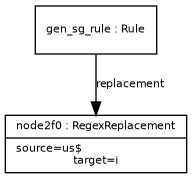

```turtle
:gen_sg_rule a morph:Rule ;
    morph:replacement [
        a morph:RegexReplacement ;
        morph:source "us$" ;
        morph:target "i" ;
    ] .
```
</aside>


The target can use backreferences (`\1`) to refer to the captured groups in the source string.


<aside class="example" title="Formation of German perfect forms">

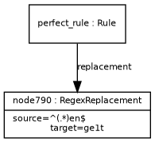

```turtle
:perfect_rule a morph:Rule ;
    morph:replacement [
        a morph:RegexReplacement ;
        morph:source "^(.*)en$" ;
        morph:target "ge\\1t" ;
    ] .
```

</aside>

In the above example, the source string `^(.*)en$` captures the stem of the verb, which is then used in the target string `ge\1t` to form the perfect tense of the verb. The `ge` prefix is added to the stem, and the `t` suffix is added to indicate the perfect tense such as *gemacht* "done" from *machen* "to do".

<!--<div class="note">
TO DISCUSS: RDF 1.1 recommends NFC normalization for all entities.

Unless specified otherwise (in the documentation of a resource), implementations SHOULD provide NFD-normalized Unicode strings for `morph:source` and `morph:target`, so that diacritics are separated from the base character as combining characters. This is a best practice that simplifies the writing of rules in many cases, as diacritic and base characters can be manipulated independently from each other.
<div>-->

</section>

<section id="involves">

## Involves

It is often desirable to preserve information about which rules were used for a form or an entry to be generated. The property **morph:involves** provides a way to do exactly that. We recommend adding this property to generated items in any implementation of the generation process.

<div class="entity">

<objectProperty>involves</objectProperty>

**URI:** [http://www.w3.org/ns/lemon/morph#involves](http://www.w3.org/ns/lemon/morph#involves)

**morph:involves** links a Rule to the Morph that is involved in the process.

<div class="description">

<domain>morph:Rule</domain>

<range>morph:Morph</range>
</div>
</div>
 
<aside class="example" title="Example: Inflection of the German verb 'aufstehen' in the perfect tense">


```turtle
:aufgestanden a ontolex:Form ;
    morph:consistsOf :auf , :ge, :stand , :en .

:perfect_tense_rule a morph:Rule ;
    morph:involves :auf, :ge, :stand, :en .
```

</aside>

TO DISCUSS: This doesn't work!

<!-- <div class="note">
Note that this does not encode order. <br/> MI: Each rule corresponds to exactly one Morph, so there is no need for ordering
</div> -->

</section>
</section>

<section id="inflection">

## Inflection

### Inflection Rules

Inflection rules are used to represent operations that create an inflected form
from a base form. This is a specific subclass of `morph:Rule` for the purpose of 
modelling inflection.


<div class="entity">

<class>InflectionRule</class>

**URI:** [http://www.w3.org/ns/lemon/morph#InflectionRule](http://www.w3.org/ns/lemon/morph#InflectionRule)

**morph:InflectionRule** represents the formal operation applied to a base form of a LexicalEntry to obtain another inflected form of that LexicalEntry.

**morph:inflectionRule** provides information on how to generate inflected forms and, in the case of a dataset with pre-generated forms, links these forms to InflectionRules that were used to generate them. If inflection slots were used, forms might have several rules attached to them.

<div class="description">

Domain: ontolex:Form

Range: morph:InflectionRule
</div>
</div>

### Inflection Classes

<div class="entity">

<class>InflectionClass</class>

**URI:** [http://www.w3.org/ns/lemon/morph#InflectionClass](http://www.w3.org/ns/lemon/morph#InflectionClass)

**morph:InflectionClass** represents the inflection class to which a LexicalEntry belongs/is assigned -- e.g., the declension of a noun, or the conjugation of a verb.
</div>

It may contain metadata information about this type of declension.

The link between inflection classes and lexical entries is not defined in OntoLex-Morph, but modelled using `ontolex:morphologicalPattern`.

<div class="entity">

<objectProperty>inflectionClass</objectProperty>

**URI:** [http://www.w3.org/ns/lemon/morph#inflectionClass](http://www.w3.org/ns/lemon/morph#inflectionClass)

**morph:inflectionClass** links an inflection rule to the inflection class it pertains to.

<div class="description">

<domain>morph:InflectionRule</domain>

<range>morph:InflectionClass</range>
</div>
</div>

In the case of fusional morphology — languages like Greek, Latin or English — there is usually only one morph attached to a form that carries information about inflection. The situation is different for languages with agglutination, where each inflectional value is represented by its own morph. In order to represent this, the model has another class.

In a fusional language like Latin, there is no need to have different inflection slots: a single inflection rule (specific for the inflection class to which the lexical entry is assigned) allows for the generation of the genitive singular form as follows:

<aside class="example" title="Example: Generation of the genitive singular form 'lupi'">

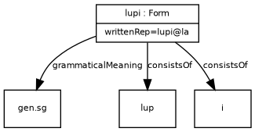

```turtle
:lupi a ontolex:Form ;
    ontolex:writtenRep "lupi"@la ;
    morph:grammaticalMeaning :gen.sg ;
    morph:consistsOf :lup , :i .
```
</aside>

<section id="inflection-slots">
## Inflection Slots

Inflection slots are used in agglutinative languages to represent the different grammatical categories that can be expressed by a single morph. In this case, the inflection rule is used to generate a form that is composed of several morphs, each of which corresponds to a different grammatical category. The inflection slots are used to specify the order in which the morphs are applied to the base form.

<div class="entity">

<class>InflectionSlot</class>

**URI:** [http://www.w3.org/ns/lemon/morph#InflectionSlot](http://www.w3.org/ns/lemon/morph#InflectionSlot)


**morph:InflectionSlot**  represents a single slot that can be filled with a morph of a corresponding grammatical category. Since one rule can introduce only one morph, inflection slots are necessary when we need to represent forms that are generated by several independent morphological processes.
</div>

<div class="note">
For agglutinative languages like Finno-Ugric, Turkic and many more, each grammatical value that is encoded with a morph: e.g. number and case for Finnish nouns — is associated with a single slot. This way, there should be two separate rules for adding number and case morphs to form an inflected Finnish noun form.
</div>

<div class="entity">

<objectProperty>inflectionSlot</objectProperty>

**URI:** [http://www.w3.org/ns/lemon/morph#inflectionSlot](http://www.w3.org/ns/lemon/morph#inflectionSlot)

**morph:inflectionSlot** links an inflection rule to the slot it pertains to

<div class="description">

<domain>morph:InflectionRule</domain>

<range>morph:InflectionSlot</range>
</div>
</div>


In order to set the order of morphs and also simplify the process of form generation, the property `morph:next` points from one InflectionSlot to the next.

<div class="entity">

<objectProperty>next</objectProperty>

**URI:** [http://www.w3.org/ns/lemon/morph#next](http://www.w3.org/ns/lemon/morph#next)

**morph:next** links two consecutive inflection types (“slots”), e.g. number and case in Finnish

<div class="description">

<domain>morph:InflectionSlot</domain>

<range>morph:InflectionSlot</range>
</div>
</div>

The example below illustrates the modelling of inflection classes and rules for the generation of the genitive singular of *lupus* in Latin.

<aside class="example" title="Example: Inflection rules for the genitive singular of 'lupus' in Latin">

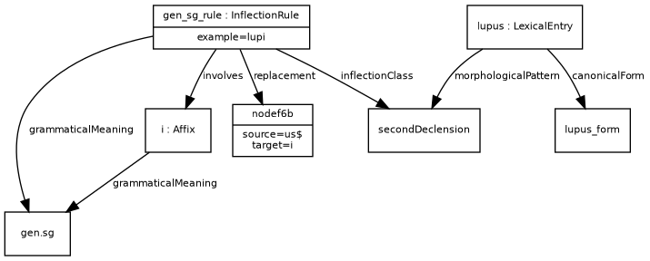

```turtle
:lupus a ontolex:LexicalEntry ;
    ontolex:canonicalForm :lupus_form ;
    ontolex:morphologicalPattern :secondDeclension .

:gen_sg_rule a morph:InflectionRule ;
    morph:example "lupi" ;
    morph:replacement [
        morph:source "us$" ;
        morph:target "i" ;
    ] ;
    morph:inflectionClass :secondDeclension ;
    morph:grammaticalMeaning :gen.sg ;
    morph:involves :i .

:i a ontolex:Affix ;
    morph:grammaticalMeaning :gen.sg .
```
</aside>
On the other hand, in an agglutinative language like Turkish, it is useful to define separate inflection slots for each morphosyntactic feature, and separate inflection rules for each inflection slot, as illustrated in the example below. 

<aside class="example" title="Example: Inflection rules for the accusative plural of words that inflect like 'adam' in Turkish">


```turtle
:adam a ontolex:LexicalEntry ;
    ontolex:canonicalForm :adam_form ;
    ontolex:morphologicalPattern :noun1_infl_vowelHarmony1 .

:adam_form a ontolex:Form ;
    ontolex:writtenRep "adam"@tur .

:sg_rule a morph:InflectionRule ;
    morph:example "adam" ;
    morph:replacement [
        morph:source "$" ;
        morph:target ""@tur ;
    ] ;
    morph:grammaticalMeaning [ lexinfo:number lexinfo:singular ; ] ;
    morph:inflectionSlot :number_slot .

:pl_rule a morph:InflectionRule ;
    morph:example "adamlar"@tur ;
    morph:replacement [
        morph:source "$" ;
        morph:target "lar"@tur ;
    ] ;
    morph:inflectionClass :noun1_infl_vowelHarmony1 ;
    morph:grammaticalMeaning [ lexinfo:number lexinfo:plural ; ] ;
    morph:involves :lar ;
    morph:inflectionSlot :number_slot . 

:acc_rule a morph:InflectionRule ;
    morph:example "adami" ;
    morph:replacement [
        morph:source "$" ;
        morph:target "i"@tur ;
    ] ;
    morph:inflectionClass :noun1_infl_vowelHarmony1 ;
    morph:grammaticalMeaning lexinfo:accusativeCase ;
    morph:involves :i ;
    morph:inflectionSlot :case_slot .

:number_slot a morph:InflectionSlot ;
    rdfs:comment "slot for number in Turkish nominal inflection" ;
    morph:next :case_slot .

:case_slot a morph:InflectionSlot ;
    rdfs:comment "slot for case in Turkish nominal inflection" .
```
</aside>

In order to generate forms of the entry `:adam`, all the rules associated with the corresponding morphological pattern must first be extracted, namely `sg_rule`, `pl_rule`, and `acc_rule`. Next, it establishes the order of inflection slots mentioned in the rules (by looking for the slot that is not used as an object in a `morph:next` property).

Then, for the first inflection slot the correct form is chosen. If there is a `morph:baseType` specified in the rule, the corresponding form is chosen. Otherwise, the canonical form is used.
Finally, for each inflection slot, the transformation is applied. For the first slot the initial form is used, after that, the output of one transformation is used as an input for the next.

With each transformation, all the properties in the grammatical meaning associated with the rule are copied to a newly created grammatical meaning. After all the transformations have been applied, the form is created with the constructed grammatical meaning. The initial form and the morphs are added as objects for the `morph:consistsOf` statements.

It is also possible to create Morph elements during generation in case they are not present in the data.

<div class="note">In case there are no inflection slots in the rules, the generation proceeds without using them.</div>

In the case of the example above, the successive application of the two appropriate rules for accusative and plural formation -- in the order established by the use of the morph:next property -- allows for the generation of the accusative plural form as follows:

<aside class="example" title="Example: Generation of the accusative plural form 'adamlar'">

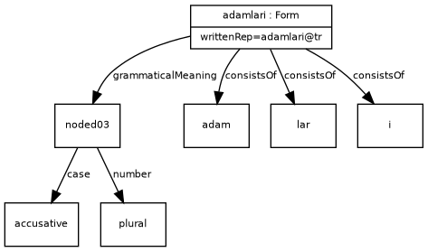

```turtle
:adamlari a ontolex:Form ;
  ontolex:writtenRep "adamlari"@tr ;
  morph:grammaticalMeaning [ 
    lexinfo:case lexinfo:accusative ;
    lexinfo:number lexinfo:plural ] ;
  morph:consistsOf :adam , :lar , :i .
```
</aside>

</section>

<section id="base-types">

## Base Types

In many cases, the inflectional paradigm of a single lexical entry involves different bases, e.g., stems. In these cases, it is useful to be able to coindex a base form, an inflection rule and the forms generated by the rule from the respective base. The property **morph:baseType** is used for this purpose.

<div class="entity">

<dataProperty>baseType</dataProperty>

**URI:** [http://www.w3.org/ns/lemon/morph#baseType](http://www.w3.org/ns/lemon/morph#baseType)

**morph:baseType** is used for coindexing a base form, an inflection rule and the forms generated by the rule from the respective base in cases in which the inflectional paradigm of a single lexical entry involves different bases, e.g., stems. 

<div class="description">

<domain>ontolex:Form or morph:InflectionRule</domain>

<range>xsd:string</range>
</div>
</div>

For instance, for Latin verbs, in addition to the citation form, dictionaries also record "principal parts" -- i.e., a set of forms from which the full paradigm of a lexeme can be inferred. For example, the entry for *rumpo* in the Lewis and Short dictionary lists the forms:

- *rumpo*, displaying the present stem *rump-*, from which other forms displaying the present stem can be inferred;
- *rupi*, displaying the perfect stem *rup-*, from which other forms displaying the perfect stem can be inferred;
- *ruptum*, displaying the so-called third stem *rupt-*, from which other forms displaying the third stem can be inferred;

This can be modelled with OntoLex-Morph as follows:

<aside class="example" title="Example: Base types for the Latin verb 'rumpo'">


```turtle
:rumpo a ontolex:LexicalEntry ;
    ontolex:canonicalForm :rumpo_form ;
    ontolex:baseForm :rupi_form , :ruptum_form ;
    ontolex:morphologicalPattern :ThirdConjugation .

:rumpo_form a ontolex:Form ;
    ontolex:writtenRep "rumpo"@la ;
    morph:grammaticalMeaning :prs.act.ind.1.sg ;
    morph:baseType "PresentStem" .

:rupi_form a ontolex:Form ;
    ontolex:writtenRep "rupi"@la ;
    morph:grammaticalMeaning :prf.act.ind.1.sg ;
    morph:baseType "PerfectStem" .

:ruptum_form a ontolex:Form ;
    ontolex:writtenRep "ruptum"@la ;
    morph:grammaticalMeaning :sup.acc ;
    morph:baseType "ThirdStem" .

:prs_act_ind_2_sg_rule a morph:InflectionRule ;
    morph:example "rumpis" ;
    morph:replacement "?" ;
    morph:inflectionClass :thirdConjugation ;
    morph:grammaticalMeaning :prs.act.ind.2.sg ;
    morph:involves :it ;
    morph:baseType "PresentStem" .

:prf_act_ind_2_sg_rule a morph:InflectionRule ;
    morph:example "rumpisti" ;
    morph:replacement "?" ;
    morph:inflectionClass :firstConjugation , :secondConjugation , :thirdConjugation , :fourthConjugation ;
    morph:grammaticalMeaning :prf.act.ind.2.sg ;
    morph:involves :isti ;
    morph:baseType "PerfectStem" .

:fut_act_ptcp_rule a morph:InflectionRule ;
    morph:example "rupturus" ;
    morph:replacement "?" ;
    morph:inflectionClass :firstConjugation , :secondConjugation , :thirdConjugation , :fourthConjugation ;
    morph:grammaticalMeaning :fut.act.ptcp ;
    morph:involves :urus ;
    morph:baseType "ThirdStem" .
```
</aside>

Note that the inflection rules operating on the perfect and third stem are not only connected to the inflection class of *rumpo*, but also other ones, as they are valid across conjugations.
By applying these rules, the following forms can be generated:

<aside class="example" title="Example: Generation of the Latin verb forms *rumpis*, *rupisti*, *rupturus*">


```turtle
:rumpis_form a ontolex:Form ;
    ontolex:writtenRep "rumpis"@la ;
    morph:grammaticalMeaning :prs.act.ind.2.sg ;
    morph:baseType "PresentStem" .

:rupisti_form a ontolex:Form ;
    ontolex:writtenRep "rupisti"@la ;
    morph:grammaticalMeaning :prf.act.ind.2.sg ;
    morph:baseType "PerfectStem" .

:ruptus_form a ontolex:Form ;
    ontolex:writtenRep "rupturus"@la ;
    morph:grammaticalMeaning :fut.act.ptcp ;
    morph:baseType "ThirdStem" .
```
</aside>

For an inflection rule with `morph:baseType` defined: If the lexical entry to which it is applied features a `morph:baseForm` or (if these are not defined) a `ontolex:canonicalForm` with identical `morph:baseType`, apply the rule to this form, only. For a (generated) form, `morph:baseType` can be used to indicate from which form or with which rule it was generated. `morph:baseType` can also be used to mark stem classes in resources for which no explicit inflection rules are given.

This was introduced for modelling stem alternations. In this definition, we assume that we have one lexical entry for each stem variant so that an inflection rule whose baseType doesn't match if its lexical entry doesn't fire.

</section>
</section>
</section>

<section id="word-formation">

## Word Formation

<section id="word-formation-rules">

Another important component of morphological structure is word formation. While inflection is concerned with morphologically related forms of the same lexeme(s), word formation is concerned with morphologically related lexemes, focusing on the specific relationships between them on the one hand, and on the processes by which derivatives can be obtained from their bases (or from each other) on the other hand.
Accordingly, at its core, the modelling of word formation in  OntoLex-Morph operates with two main components:

- word formation **relations** are established between lexical entries that are morphologically related
- word formation **rules** are used to describe the formal instructions involved in the processes of formation of derivatives.

In the following (sub)sections, these two components are described in detail and exemplified.

## Word Formation Relations

A piece of information regarding word formation that is often provided for both traditional dictionaries and digital morphological resources is which lexical entries are morphologically related: for instance, dictionaries often record the base of morphologically complex lexical entries, as illustrated below in the entry for the Italian noun *trattamento* 'treatment', derived from the verb *trattare* 'to treat' in the online Treccani dictionary.

**trattaménto** s. m. [der. di *trattare*]

To be able to not only encode this descriptive information but also possibly further specify it by expressing additional details, in OntoLex-Morph word formation relations are reified in a dedicated class, `morph:WordFormationRelation`. 
Since word formation relations are relations between different lexical entries, this class is defined as a subclass of the class introduced in the vartrans module of OntoLex for such relations -- namely, `vartrans:LexicalRelation`. As a consequence, vartrans properties are also used to link lexical entries to the relations holding between them: specifically, each word formation relation is linked through `vartrans:source` to its base(s) and through `vartrans:target` to the derivative.

<div class="entity">

<class>WordFormationRelation</class>

**URI:** [http://www.w3.org/ns/lemon/morph#WordFormationRelation](http://www.w3.org/ns/lemon/morph#WordFormationRelation)

**morph:WordFormationRelation** is a subclass of `vartrans:LexicalRelation` that relates two lexical entries that are morphologically related, with the property `vartrans:target` linking the relation to the resulting lexical entry, and the property `vartrans:source` linking it to the morphological base (in derivation) or head and other constituents (in compounding).

<div class="description">

<subclass>vartrans:LexicalRelation</sub>

</div>
</div>

Accordingly, the morphological derivation of German *Schönheit* 'beauty' can be encoded as follows:

<aside class="example" title="Example: Derivation of the German noun *Schönheit*">

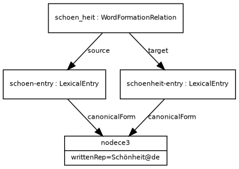

```turtle
:schoenheit-entry a ontolex:LexicalEntry;
             ontolex:canonicalForm [ ontolex:writtenRep "Schönheit"@de ].
:schoen-entry a ontolex:LexicalEntry;
             ontolex:canonicalForm [ ontolex:writtenRep "schön"@de ].
:schoen_heit a morph:WordFormationRelation;
             vartrans:source :schoen-entry;
             vartrans:target :schoenheit-entry.
```
</aside>

The same kind of modelling can be applied to compounds -- i.e., lexemes that are morphologically related to two or more bases; e.g. English  *wallpaper*.

It should be noted that there is another OntoLex module that was envisaged to be usable also for compounding, namely decomp, devised for the decomposition of complex lexical entries (like Multi-Word Expressions) in their parts. However, in OntoLex-decomp the relationship between complex lexical entries and their parts is not reified, as there is no dedicated class, differently than what happens in OntoLex-morph for word formation relations.

As a consequence, to allow for a parallel treatment of different word formation processes (derivation and compounding), a subclass of `morph:WordFormationRelation` is introduced for compounding -- namely, `morph:CompoundRelation`. This can be considered as a reification of the property `decomp:subTerm`, which be used to decompose lexical entries into other lexical entries: hence, the existence of a compound relation entails that the source lexical entry is a subterm of the compound.
Since, by definition, compounds have more than one base, there will also be more than one compound relation: one relation with the target compound should be introduced for each of the constituents of the compound.

<div class="entity">

<class>CompoundRelation</class>

**URI:** [http://www.w3.org/ns/lemon/morph#CompoundRelation](http://www.w3.org/ns/lemon/morph#CompoundRelation)

**morph:CompoundRelation** is a `morph:WordFormationRelation` that connects a (lexical entry representing a) morphological constituent of a compound with the (lexical entry representing the) compound. 

<div class="description">

<subclass>morph:WordFormationRelation</subclass>

</div>

</div>

Furthermore, compounds can have a head -- i.e., a constituent that imposes its morphosyntactic and semantic properties on the whole word. For instance, It. *capo-stazione* 'station master' inherits the fact of being a masculine noun denoting a person from its head *capo* 'chief', rather than from the other constituent *stazione* 'station'. In morph, a subclass of compound relations is introduced to express this information -- namely, `morph:CompoundHead`.

<div class="entity">

<class>CompoundHead</class>

**URI:** [http://www.w3.org/ns/lemon/morph#CompoundHead](http://www.w3.org/ns/lemon/morph#CompoundHead)

**morph:CompoundHead** is a `morph:WordFormationRelation` that connects the (lexical entry representing the) morphological head of a compound with the (lexical entry representing the) compound.

<div class="description">

<subclass>morph:CompoundRelation</subclass>

</div>

</div>


</section>

Accordingly, the morphological derivation of Italian *capostazione* 'station mastes' (from *capo* 'head'  + *stazione* 'station') can be encoded as follows:

<aside class="example" title="Example: Derivation of the Italian noun *capostazione*">

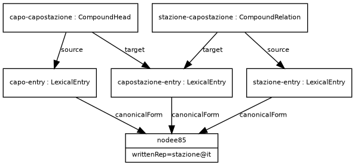

```turtle
:capostazione-entry a ontolex:LexicalEntry;
             ontolex:canonicalForm [ ontolex:writtenRep "capostazione"@it ].
:capo-entry a ontolex:LexicalEntry;
             ontolex:canonicalForm [ ontolex:writtenRep "capo"@it ].
:stazione-entry a ontolex:LexicalEntry;
             ontolex:canonicalForm [ ontolex:writtenRep "stazione"@it ].
:capo-capostazione a morph:CompoundHead;
             vartrans:source :capo-entry;
             vartrans:target :capostazione-entry.
:stazione-capostazione a morph:CompoundRelation;
             vartrans:source :stazione-entry;
             vartrans:target :capostazione-entry.
```
</aside>

### Word Formation Rules

In addition to relations between morphologically related lexemes, one can be interested in expressing the formal instructions needed to generate derived lexemes from their bases. To do that, another sub-class of `morph:Rule` is introduced, alongside `morph:InflectionRule`, namely `morph:WordFormationRule`.
Like inflection rules, word formation rules can take as input either the canonical form of the input lexical entry, or another form that is used as the base form, and they can involve specific morphs.

<div class="entity">

<class>WordFormationRule</class>

**URI:** [http://www.w3.org/ns/lemon/morph#WordFormationRule](http://www.w3.org/ns/lemon/morph#WordFormationRule)

**morph:WordFormationRule** represents the formal operation applied to a base form of a source LexicalEntry to obtain another, target LexicalEntry .

<div class="description">
<subclass>morph:Rule</sub>
</div>

</div>

Word formation rules can also be related to the word formation relations existing between the lexical entries involved through the property `morph:wordFormationRule`.

<div class="entity">

<objectProperty>wordFormationRule</objectProperty>

**URI:** [http://www.w3.org/ns/lemon/morph#wordFormationRule](http://www.w3.org/ns/lemon/morph#WordFormationRule)

**morph:wordFormationRule** relates a word formation relation to the word formation rule that is applied to the source lexical entry in order to obtain the target lexical entry.

<div class="description">

<domain>morph:WordFormationRelation</domain>

<range>morph:WordFormationRule</range>

</div>
</div>

Unlike inflection rules, word formation rules generate lexical entries rather than forms -- this can be expressed through the property `morph:generates`.

<div class="entity">

<objectProperty>generates</objectProperty>

**URI:** [http://www.w3.org/ns/lemon/morph#generates](http://www.w3.org/ns/lemon/morph#generates)

**morph:generates** connects a word formation rule to the  lexical entries that are generated from it

<div class="description">

<domain>morph:WordFormationRule</domain>

<range>ontolex:LexicalEntry</range>

</div>
</div>

Accordingly, if one wanted to express the formal operation involved in the morphological derivation of German *Schönheit* 'beauty', this can be done as follows:

<aside class="example" title="Example: Formal operation involved in the derivation of the German noun *Schönheit*">

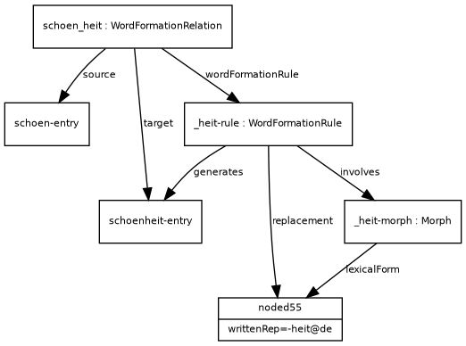

```turtle

:schoen_heit a morph:WordFormationRelation;
             vartrans:source :schoen-entry;
             vartrans:target :schoenheit-entry;
             morph:wordFormationRule :_heit-rule.
:_heit-rule a morph:WordFormationRule;
            morph:replacement [
		        morph:source "$" ;
		        morph:target "heit" ;
			    ] ;
            morph:involves :_heit-morph;
            morph:generates :schoenheit-entry.
:_heit-morph a morph:Morph;
            ontolex:lexicalForm [ ontolex:writtenRep "-heit"@de ].

```
</aside>

Two sub-classes of `morph:WordFormationRule` are introduced corresponding to the traditional division of the realm of word formation into derivation and compounding.
In derivation rules, lexemes are obtained from a single base through the addition of one (or possibly more than one, as in the case of parasynthesis) derivational affixes.

<div class="entity">

<class>DerivationRule</class>

**URI:** [http://www.w3.org/ns/lemon/morph#DerivationRule](http://www.w3.org/ns/lemon/morph#DerivationRule)

**morph:DerivationRule** refers to rules that take one LexicalEntry as input and generate another LexicalEntry as output through the addition of one or more derivational affix(es).

<div class="description">

<subclass>morph:WordFormationRule</subclass>

</div>

</div>

In compounding rules, two different bases are combined to obtain a new lexeme, possibly also involving an interfix or linking element.

<div class="entity">

<class>CompoundingRule</class>

**URI:** [http://www.w3.org/ns/lemon/morph#DerivationRule](http://www.w3.org/ns/lemon/morph#DerivationRule)

**morph:CompoundingRule** refers to rules that take more than one LexicalEntry as input to generate the output LexicalEntry.

<div class="description">

<subclass>morph:WordFormationRule</subclass>

</div>

</div>

To illustrate the usage of `morph:DerivationRule`, the reader is referred to the example given above for word formation rules: indeed, the rule used there can be assigned to the more specific class for derivation rules, with every other assertion remaining unchanged as this class is a sub-class of `morph:WordFormationRule`.

<aside class="example" title="Example: Rule for German 'Schönheit' as an instance of morph:DerivationRule">

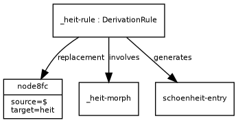

```turtle

:_heit-rule a morph:DerivationRule;
            morph:replacement [
		        morph:source "$" ;
		        morph:target "heit" ;
			    ] ;
            morph:involves :_heit-morph;
            morph:generates :schoenheit-entry.

```
</aside>

As for compounding, the example below illustrates the modelling of a rule involving a linking element for Dutch *schaapskop* 'sheep head'.

<aside class="example" title="Example: Rules for Dutch 'schaapskop'">

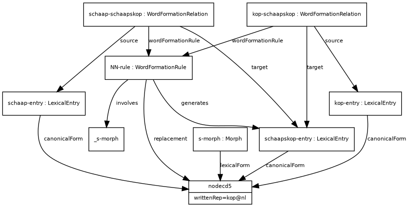

```turtle

:schaapskop-entry a ontolex:LexicalEntry;
             ontolex:canonicalForm [ ontolex:writtenRep "schaapskop"@nl ].
:schaap-entry a ontolex:LexicalEntry;
             ontolex:canonicalForm [ ontolex:writtenRep "schaap"@nl ].
:kop-entry a ontolex:LexicalEntry;
             ontolex:canonicalForm [ ontolex:writtenRep "kop"@nl ].
:schaap-schaapskop a morph:WordFormationRelation;
             vartrans:source :schaap-entry;
             vartrans:target :schaapskop-entry;
             morph:wordFormationRule :NN-rule.
:kop-schaapskop a morph:WordFormationRelation;
             vartrans:source :kop-entry;
             vartrans:target :schaapskop-entry;
             morph:wordFormationRule :NN-rule.
:NN-rule a morph:WordFormationRule;
            morph:replacement [
		        # ??? (MP: here it is not clear to me how to implement the replacement with concatenation of both bases, I leave it to be discussed in the next meeting)
			    ] ;
            morph:involves :_s-morph;
            morph:generates :schaapskop-entry.
:s-morph a morph:Morph;
            ontolex:lexicalForm [ ontolex:writtenRep "-s"@nl ].

```
</aside>

</section>
